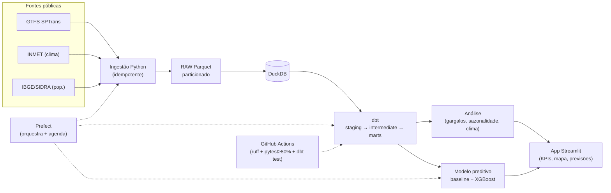
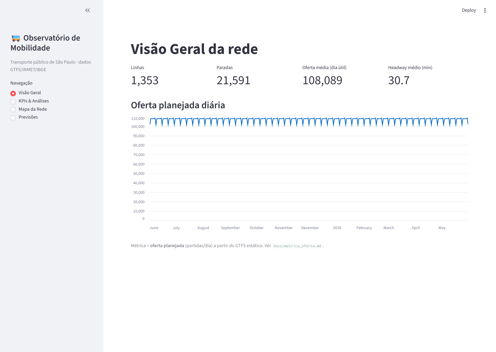
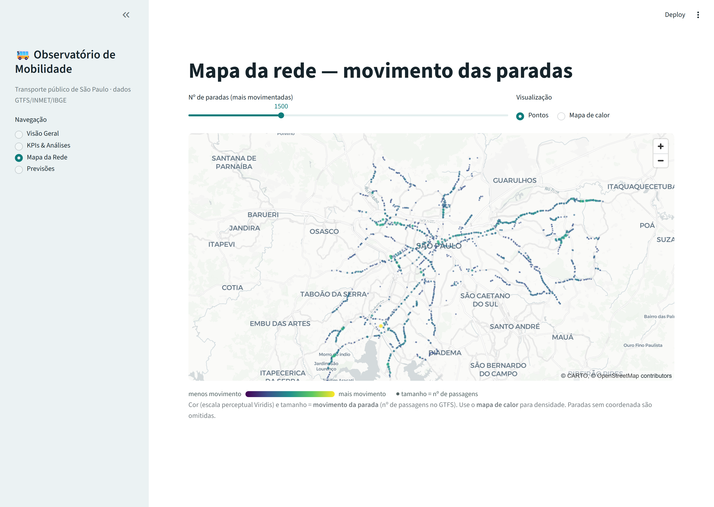
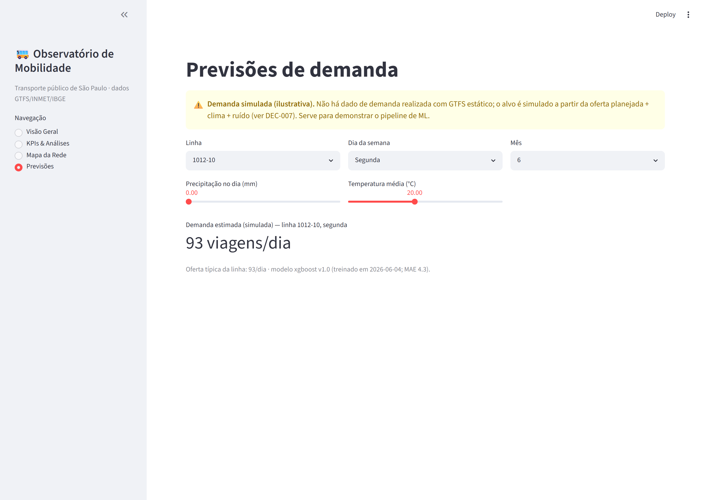

# Observatório de Mobilidade Urbana 🚌

> Projeto de dados **end-to-end** (Engenharia + Análise + App) sobre o
> transporte público de São Paulo — construído com a metodologia de
> **documentação viva + agente executor**.

[](https://github.com/TatianaCalixto/observatorio-mobilidade/actions/workflows/ci.yml)
[](https://observatorio-mobilidade-xrx2sfcmn4fzwztmuwhphc.streamlit.app/)

🌐 **App ao vivo:** <https://observatorio-mobilidade-xrx2sfcmn4fzwztmuwhphc.streamlit.app/>

Este repositório tem **duas camadas de leitura**:

1. **O produto** — um pipeline ELT reprodutível (GTFS/INMET/IBGE → DuckDB → dbt) e um
   dashboard Streamlit, com um modelo preditivo de apoio, que responde a uma pergunta de negócio.
2. **O método** — todo o projeto foi planejado e executado como um **caso de uso de
   documentação viva**: uma planilha de sprints é a *fonte única de verdade* e um agente
   executor (Claude Code) trabalhou tarefa por tarefa, sem fechar nada sem teste verde e
   parando para perguntar sempre que uma decisão saía do escopo.

---

## A pergunta de negócio

> **Dá para prever atrasos/demanda no transporte público a partir de dia da semana, clima
> e linha — e onde estão os principais gargalos da rede?**

### A resposta (honesta)

A única fonte de horários disponível é o **GTFS estático** (o serviço **planejado**), sem
dados realizados. Em vez de inventar "atrasos reais", o projeto modela a **oferta
planejada** (partidas/dia por linha e *headway*) e responde:

| Fator | Prevê a oferta planejada? |
|---|---|
| **Linha** | ✅ é o maior determinante (metrô ~2,6 min de headway; linhas noturnas até 60 min) |
| **Dia da semana** | ✅ útil **169.638** > sábado **162.599** > domingo **152.024** partidas/dia |
| **Clima** | ❌ correlação ≈ 0 — o serviço **planejado não muda com o tempo** (o clima afetaria a demanda *realizada*, que não existe nesta fonte) |

Esse "não" é um resultado de verdade: está documentado em
[`docs/metrica_oferta.md`](docs/metrica_oferta.md) e
[`analysis/relatorio_insights.md`](analysis/relatorio_insights.md), e levou a uma decisão
explícita sobre o alvo do ML (ver [Decisões](docs/sprints_decisoes.md), DEC-007).

---

## Arquitetura



- **Local-first**: roda 100% na máquina (DuckDB, sem infra paga obrigatória).
- **Camadas explícitas**: `raw` (imutável) → `staging` → `intermediate` → `marts`.
- **Idempotência** e **reprodutibilidade**: ambiente travado por lockfile, seeds fixas no ML.

---

## Resultados e insights

- **Gargalos de regularidade**: linhas periféricas/noturnas com *headway* de até **60 min**;
  no extremo oposto, o **metrô** (Linha 1: ~1.408 partidas/dia, headway 2,6 min).
- **Sazonalidade**: a oferta cai ~10% no domingo; é constante entre dias úteis (propriedade
  honesta do dado planejado).
- **Modelo preditivo**: prevendo uma **demanda simulada e rotulada** (DEC-007), o **XGBoost
  (MAE 6,8)** supera o baseline (MAE 17,9) ao capturar o efeito do clima — com split
  **temporal sem vazamento** e tracking no **MLflow**.

📄 Relatório reproduzível: [`analysis/relatorio_insights.md`](analysis/relatorio_insights.md)
· 📐 Métrica central: [`docs/metrica_oferta.md`](docs/metrica_oferta.md)

---

## O app em ação

Dashboard Streamlit (`make app`) com KPIs, análises, mapa interativo e previsões.

| Visão Geral | Mapa da rede |
|---|---|
|  |  |

A seção de **previsões** deixa explícito que a demanda é **simulada/ilustrativa** (decisão
de honestidade, DEC-007):



---

## O método: documentação viva + agente executor

O diferencial deste portfólio é **como** ele foi feito. Duas fontes de verdade versionadas
guiaram tudo:

- **[`blueprint.md`](blueprint.md)** — referência funcional (pergunta, fontes, arquitetura, roadmap).
- **Planilha de sprints** (`.xlsx`, renderizada em MD legível abaixo) — verdade operacional:
  40 tarefas em 8 sprints, cada uma com **critérios de aceitação** e **testes obrigatórios**.

Regras inegociáveis aplicadas pelo agente executor ([prompt](PROMPT_INICIAL_CLAUDE_CODE.md)):
**sem teste verde, a tarefa não fecha**; toda regra de negócio tem **teste de regressão**;
em qualquer dúvida de escopo, **parar e perguntar** (virou um impedimento registrado).

| Planejamento (renderizado da planilha) | |
|---|---|
| [Visão Geral](docs/sprints_visao_geral.md) | status das 8 sprints |
| [Backlog](docs/sprints_backlog.md) | as 40 tarefas, critérios e testes |
| [Plano de Testes](docs/sprints_plano_testes.md) | checks de regressão por sprint |
| [Decisões](docs/sprints_decisoes.md) | ADRs do dia a dia (DEC-001…007) |
| [Impedimentos](docs/sprints_impedimentos.md) | dúvidas que pararam a execução |

> Esses arquivos mostram o **rastro auditável**: por que cada escolha técnica foi feita
> (DuckDB, mirror público do GTFS, métrica de oferta, alvo de ML) e onde o agente parou
> para perguntar em vez de improvisar.

ADRs consolidados: [`docs/adr/`](docs/adr/).

---

## Stack

| Camada | Ferramenta |
|---|---|
| Linguagem / ambiente | **Python 3.12** + **uv** (lockfile) |
| Ingestão | `requests`/`httpx`, GTFS/CSV/API |
| RAW | **Parquet** · Warehouse: **DuckDB** |
| Transformação | **dbt-duckdb** (+ testes e *unit tests*) |
| ML | **scikit-learn / XGBoost** + **MLflow** |
| App | **Streamlit** + **pydeck** (mapa) |
| Orquestração | **Prefect** (schedule + retries) |
| Qualidade / CI | **ruff**, **pytest** (cobertura ≥ 80%), **pre-commit**, **GitHub Actions** |
| Empacotamento | **Dockerfile** (multi-stage), **Makefile** |

---

## Como reproduzir

Pré-requisitos: [uv](https://docs.astral.sh/uv/) (e, opcional, Docker).

```bash
# 1. Ambiente
make setup                 # uv sync (cria .venv com Python 3.12)
cp .env.example .env       # ajusta a janela temporal e as fontes

# 2. Pipeline completo (ingestão → DuckDB → dbt → modelo)
make ingest                # popula RAW + DuckDB (idempotente)
make dbt-build             # staging → intermediate → marts (+ testes)
make train                 # baseline + XGBoost + MLflow + modelo serializado
#   ... ou tudo orquestrado pelo Prefect:
uv run python -m orchestration.flow

# 3. App
make app                   # http://localhost:8501

# Qualidade
make lint && make test     # ruff + pytest
```

Tudo também roda em container: `docker build -t observatorio-mobilidade . && docker run -p 8501:8501 observatorio-mobilidade`.
Detalhes em [`docs/orquestracao.md`](docs/orquestracao.md).

---

## Estrutura do repositório

```
.
├── ingestion/     # coleta GTFS/INMET/IBGE → RAW Parquet → DuckDB
├── transform/     # projeto dbt (staging → intermediate → marts + testes)
├── ml/            # features (split temporal), baseline, XGBoost, MLflow, serialização
├── app/           # dashboard Streamlit (dados/predição/mapa testáveis + UI)
├── analysis/      # consultas analíticas + relatório de insights reprodutível
├── orchestration/ # flow Prefect (ingestão → dbt → treino) + schedule
├── tests/         # 102 testes pytest (incl. regressões críticas)
├── docs/          # métrica, ADRs, orquestração, planejamento renderizado
├── blueprint.md   # referência funcional
└── observatorio_mobilidade_planejamento_sprints.xlsx  # verdade operacional
```

---

## Aprendizados

- **Honestidade > impressão.** Descobrir que o clima não prevê a oferta *planejada* (corr ≈ 0)
  é um resultado melhor de comunicar do que um número inflado. Virou decisão registrada e um
  alvo de ML **simulado e claramente rotulado**, em vez de fingir dados realizados.
- **Testes como trava operacional funcionam.** O gate de cobertura (≥80%) pegou uma regressão
  real: os testes do app dependiam do banco/`.env` locais; no CI a cobertura caía para 79%.
  Forçou um *warehouse* de teste determinístico — exatamente o tipo de bug que a fase de
  hardening existe para travar.
- **Parar e perguntar economiza retrabalho.** Os impedimentos (fonte do GTFS, métrica,
  alvo do ML) eram decisões de escopo de verdade; decidi-los sozinho teria custado caro.
- **`make all` reprodutível desde a Sprint 1.** Ter ambiente travado + CI verde antes de
  qualquer dado real deixou todas as sprints seguintes "boringly" reprodutíveis.

---

_Repositório mantido como portfólio. O foco é o **método** (documentação viva + agente
executor) tanto quanto o **produto**._
