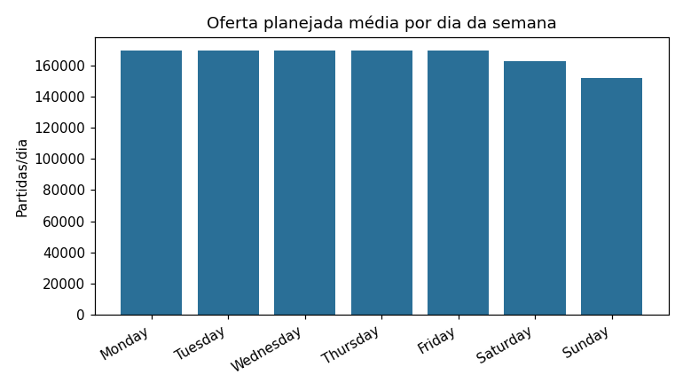
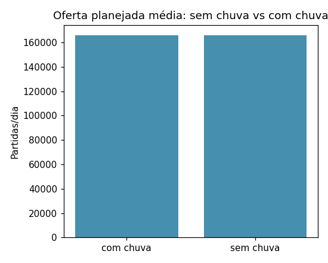

# Relatório de insights — Observatório de Mobilidade

> Reproduzível: gerado por `analysis/gerar_relatorio.py` a partir dos marts dbt.
> Período analisado: **2025-06-01 a 2026-05-31** ·
> **1353** linhas · **22145** paradas.

## Pergunta de negócio

> Dá para prever atrasos/demanda no transporte público a partir de fatores como dia da
> semana, clima e linha — e onde estão os principais gargalos da rede?

Como a fonte é o **GTFS estático** (serviço planejado, sem realizado), a métrica central é
a **oferta planejada** — nº de partidas/dia por linha e *headway* (regularidade). Ver
[`docs/metrica_oferta.md`](../docs/metrica_oferta.md).

## Insight 1 — A oferta cai no fim de semana (dia da semana **prediz** a oferta)

A rede planeja **169,638** partidas em dias úteis, **162,599** no sábado e
**152,024** no domingo (≈ 10% a menos que no dia útil).

| Dia | Oferta média/dia |
|---|---|
| Monday | 169638.0 |
| Tuesday | 169638.0 |
| Wednesday | 169638.0 |
| Thursday | 169638.0 |
| Friday | 169638.0 |
| Saturday | 162599.0 |
| Sunday | 152024.0 |

## Insight 2 — Gargalos de regularidade: linhas com *headway* de até 60 min

As piores esperas estão em linhas periféricas/noturnas (headway ~60 min):

| Linha | Headway médio (min) | Oferta média/dia |
|---|---|---|
| N637-11 | 60.0 | 5.0 |
| N235-11 | 60.0 | 5.0 |
| N731-11 | 60.0 | 9.0 |
| N738-11 | 60.0 | 5.0 |
| N143-11 | 60.0 | 5.0 |

No extremo oposto, o **metrô** concentra a alta frequência (headways de poucos minutos):

| Linha | Oferta média/dia | Headway médio (min) |
|---|---|---|
| METRÔ L1 | 1408.0 | 2.6 |
| METRÔ L2 | 1349.0 | 2.7 |
| METRÔ L3 | 814.0 | 4.1 |
| METRÔ L4 | 736.0 | 3.6 |
| 5031-10 | 681.0 | 5.3 |

## Insight 3 — O clima **não** prediz a oferta planejada

Correlação entre clima e oferta diária é praticamente nula:
**precipitação × oferta = -0.0085**, **temperatura × oferta = -0.0629**.

| Condição | Dias | Oferta média/dia | Headway médio (min) |
|---|---|---|---|
| com chuva | 152 | 165954.0 | 25.5 |
| sem chuva | 213 | 166166.0 | 25.49 |

Isso é **esperado e honesto**: o serviço planejado não muda com o tempo. O clima
afetaria a **demanda/atraso realizado** — que não está disponível com GTFS estático.

## Resposta à pergunta de negócio

| Fator | Prediz a oferta planejada? |
|---|---|
| **Linha** | **Sim** — é o maior determinante da oferta/headway. |
| **Dia da semana** | **Sim** — útil > sábado > domingo. |
| **Clima** | **Não** — correlação ≈ 0 com o planejado (afetaria o realizado). |

**Gargalos:** linhas periféricas/noturnas com headway de ~60 min concentram as piores
esperas; o metrô é o oposto (altíssima frequência).
